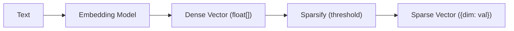

# 2026-02-15 VecFS Embedding Script Plan

This note explores adding a model-agnostic embedding script to VecFS so that text can be converted to sparse vectors without requiring the agent itself to generate embeddings. The script would live in the skill's `scripts/` directory and be callable by agents or humans.

# The Gap

The VecFS MCP server accepts pre-computed vectors (dense or sparse) but has no built-in way to turn text into a vector. Today the `memorize` and `search` tools require the caller to supply a vector alongside the text. This creates a chicken-and-egg problem: the skill instructs an agent to memorize and search, but the agent needs an embedding step that VecFS does not provide.

A bundled embedding script closes this gap and keeps the system self-contained. The agent calls the script to obtain a vector, then passes it to the MCP tool. Alternatively the script could call the MCP tool directly, combining both steps.

# Why Python

Python is the natural choice for the embedding script.

- Every major embedding provider has a first-class Python SDK.
- Local models (Sentence Transformers, via PyTorch or ONNX) run natively in Python.
- The VecFS skill already targets agents that operate in a shell environment where Python is typically available.
- A Python script avoids coupling the embedding logic to the TypeScript server, keeping the two concerns cleanly separated.

# Pydantic AI Embedder

The Pydantic AI library (`pydantic-ai`) provides a unified `Embedder` class that supports multiple providers behind a single interface. This is a strong fit for a model-agnostic design.

## Provider Coverage

| Provider             | Example Model String                          | Dimensions   |
|----------------------|-----------------------------------------------|--------------|
| OpenAI               | `openai:text-embedding-3-small`               | 1536 (configurable down to 256) |
| Google Gemini        | `google-gla:gemini-embedding-001`             | 3072 (configurable down to 768) |
| Cohere               | `cohere:embed-v4.0`                           | 1024 (configurable down to 256) |
| VoyageAI             | `voyageai:voyage-3.5`                         | 1024 (configurable down to 512) |
| AWS Bedrock / Titan  | `bedrock:amazon.titan-embed-text-v2:0`        | 1024 (configurable down to 256) |
| Sentence Transformers| `sentence-transformers:all-MiniLM-L6-v2`      | 384 (fixed)  |
| Ollama (local)       | `ollama:nomic-embed-text`                     | 768 (fixed)  |

All cloud providers are accessed via environment-variable API keys. Sentence Transformers and Ollama run locally with no network or API cost, which aligns with VecFS's local-first principle from `docs/goals.md`.

## Key Features

### Query vs Document Embeddings

Some models optimise differently depending on whether the text is a search query or a document being indexed. Pydantic AI exposes this via `embed_query()` and `embed_documents()`. The VecFS script should use `embed_query` when generating a vector for the `search` tool and `embed_documents` when generating a vector for `memorize`.

### Dimension Reduction

Most cloud models support reducing the output dimension count via an `EmbeddingSettings(dimensions=N)` parameter. This is valuable for VecFS because fewer dimensions means fewer non-zero entries after sparsification, which means smaller files.

### Local Models

The `sentence-transformers` provider downloads a model from Hugging Face on first use and runs inference locally. This means the embedding script can work fully offline after the initial download, with no API charges.

# Embedding-to-Sparse Pipeline

The script bridges text and VecFS's sparse format through a three-stage pipeline.



## Stage 1: Text to Dense Vector

The embedding model converts the input text into a fixed-length array of floats. The length depends on the model and any dimension-reduction setting.

## Stage 2: Dense to Sparse

The dense vector is converted to a sparse representation by dropping components whose absolute value falls below a threshold. This mirrors the `toSparse` function in `ts-src/sparse-vector.ts`.

## Stage 3: Output

The script outputs a JSON object containing the sparse vector, ready to be passed to the `memorize` or `search` MCP tool.

# Sparsification Strategy

The threshold parameter controls the trade-off between storage size and retrieval accuracy.

## Threshold Selection

A threshold of 0 retains every non-zero component (no compression beyond the embedding model's own sparsity). A higher threshold drops more components, reducing file size but potentially losing semantic signal.

Empirically, embedding vectors from models like `text-embedding-3-small` have most of their energy concentrated in a minority of dimensions. A threshold of 0.01 typically drops 30-50% of components with negligible impact on cosine similarity. A threshold of 0.05 can drop 60-80% of components but may begin to degrade retrieval quality.

## Normalisation Before Thresholding

Embedding models may or may not L2-normalise their output. If the output is not normalised, component magnitudes vary with input length, making a fixed threshold unreliable. The script should L2-normalise the dense vector before applying the threshold, ensuring consistent sparsification behaviour regardless of input.

## Alternative: Top-K Sparsification

Instead of a magnitude threshold, the script could keep only the K largest-magnitude components. This gives a fixed sparsity level per entry, making storage costs predictable. However, it discards the information that some texts are inherently more "spread out" across dimensions than others. The threshold approach preserves this signal.

The recommended default is threshold-based sparsification with an option to switch to top-K if predictable entry sizes are needed.

# Script Design

## Location

The embedding source lives in `py-src/vecfs_embed/`, the project's Python source directory. The skill's `scripts/` directory would contain a thin wrapper that delegates to this module.

## Modes

### Single Text (default)

Accepts text as a positional argument or on stdin. Writes a single JSON object to stdout.

```bash
uv run python -m vecfs_embed --mode query "sparse vector storage"
uv run python -m vecfs_embed --mode document "Cosine similarity works for sparse vectors"
```

### Batch

Reads one text per line from stdin. Writes a JSON array to stdout.

```bash
cat chunks.txt | uv run python -m vecfs_embed --batch --mode document
```

### Calibrate

Reads sample texts from stdin (one per line), embeds them, and reports magnitude statistics instead of vectors. Helps the user choose a threshold for their model and domain.

```bash
cat docs/*.md | uv run python -m vecfs_embed --calibrate
```

## Output Format

### Single

```json
{
  "vector": {"3": 0.42, "17": -0.31, "128": 0.15},
  "model": "sentence-transformers:all-MiniLM-L6-v2",
  "dense_dimensions": 384,
  "non_zero_count": 230,
  "threshold": 0.01
}
```

### Batch

```json
[
  {"vector": {"3": 0.42, "17": -0.31}, "model": "...", "dense_dimensions": 384, "non_zero_count": 87, "threshold": 0.01},
  {"vector": {"5": 0.18, "99": 0.55}, "model": "...", "dense_dimensions": 384, "non_zero_count": 92, "threshold": 0.01}
]
```

### Calibrate

```json
{
  "model": "sentence-transformers:all-MiniLM-L6-v2",
  "dense_dimensions": 384,
  "sample_count": 50,
  "magnitude_stats": {
    "min": 0.0002,
    "max": 0.1834,
    "mean": 0.0312,
    "p10": 0.0041,
    "p25": 0.0098,
    "p50": 0.0245,
    "p75": 0.0461,
    "p90": 0.0703
  },
  "sparsity_at_thresholds": {
    "0.001": {"mean_retained_pct": 95.2},
    "0.005": {"mean_retained_pct": 82.1},
    "0.01":  {"mean_retained_pct": 61.4},
    "0.02":  {"mean_retained_pct": 42.7},
    "0.05":  {"mean_retained_pct": 18.3}
  }
}
```

The `vector` field in single and batch output is directly usable as the `vector` argument to the `memorize` or `search` MCP tools.

## Configuration

Configuration is via environment variables, following the convention of the Pydantic AI Embedder. CLI flags override environment variables when both are present.

| Variable                | CLI Flag        | Purpose                        | Default                                    |
|-------------------------|-----------------|--------------------------------|--------------------------------------------|
| `VECFS_EMBED_MODEL`    | `--model`       | Provider and model string      | `sentence-transformers:all-MiniLM-L6-v2`   |
| `VECFS_EMBED_DIMS`     | `--dims`        | Dimension reduction            | (model default)                            |
| `VECFS_EMBED_THRESHOLD`| `--threshold`   | Sparsification threshold       | `0.01`                                     |

API keys are set through each provider's standard variable (`OPENAI_API_KEY`, `GOOGLE_API_KEY`, `CO_API_KEY`, etc.) as documented by Pydantic AI.

The default model is `sentence-transformers:all-MiniLM-L6-v2` because it requires no API key, runs locally, and produces compact 384-dimension vectors.

## Dependencies

Dependencies are managed by `uv` via `py-src/pyproject.toml`. The base install includes Sentence Transformers support for local-first operation.

```bash
cd py-src
uv sync                                        # base install (local models)
uv sync --extra openai                          # add OpenAI support
uv sync --extra google                          # add Google support
```

Provider extras are optional and documented but not required for the default local model.

# Compression Characteristics

The table below estimates the storage impact of the embedding-to-sparse pipeline for a single entry using different models and thresholds. "Sparse ratio" is the fraction of dimensions retained.

| Model                               | Dense Dims | Threshold | Sparse Ratio | Approx Sparse Dims |
|--------------------------------------|------------|-----------|--------------|---------------------|
| sentence-transformers:all-MiniLM-L6-v2 | 384      | 0.01      | ~60%         | ~230                |
| openai:text-embedding-3-small       | 1536       | 0.01      | ~50%         | ~770                |
| openai:text-embedding-3-small       | 256        | 0.01      | ~70%         | ~180                |
| google-gla:gemini-embedding-001     | 768        | 0.01      | ~55%         | ~420                |
| cohere:embed-v4.0                   | 256        | 0.01      | ~65%         | ~165                |

Combining provider-side dimension reduction (e.g., OpenAI 1536 to 256) with VecFS sparsification delivers double compression. The smallest footprint comes from a reduced-dimension cloud model or a compact local model.

# Integration with the Skill

## Context Sweep (Search)

The skill instructs the agent to:

1. Run `embed.py --mode query` with the user's question.
2. Pass the resulting sparse vector to the `search` MCP tool.
3. Incorporate results into reasoning.

## Reflective Learning (Memorise)

The skill instructs the agent to:

1. Summarise the key lesson as a short text.
2. Run `embed.py --mode document` with that text.
3. Pass the resulting sparse vector and the text to the `memorize` MCP tool.

## Skill Compatibility Note

The skill's `SKILL.md` frontmatter should update the `compatibility` field to note the Python dependency:

```yaml
compatibility: >
  Requires a running VecFS MCP server (stdio or HTTP mode), Node.js 22+,
  and Python 3.10+ with pydantic-ai for embedding generation.
```

# Implementation Steps

## Step 1: Initialise the Python Project

Create `py-src/` with a `pyproject.toml` managed by `uv`. Define the `vecfs_embed` package with optional dependency groups for each cloud provider.

```bash
cd py-src && uv sync
```

## Step 2: Implement sparsify.py

A small, pure-Python module implementing L2 normalisation, threshold-based sparsification, and top-K sparsification. This mirrors the logic of `ts-src/sparse-vector.ts` in Python and can be tested independently of any embedding model.

## Step 3: Implement embed.py

The core module that wraps Pydantic AI's `Embedder`. Handles provider instantiation, dimension settings, and the dense-to-sparse pipeline.

## Step 4: Implement cli.py and __main__.py

The CLI entry point using `argparse`. Supports `--mode`, `--batch`, `--calibrate`, `--model`, `--dims`, and `--threshold` flags. Reads environment variables as defaults.

## Step 5: Test Locally

Verify the script with the default Sentence Transformers model (no API key needed):

```bash
cd py-src
echo "test input" | uv run python -m vecfs_embed --mode query
```

Verify the output is valid JSON with a sparse vector.

## Step 6: Update Skill Instructions

Add embedding instructions to the skill's `SKILL.md` body sections for Context Sweep and Reflective Learning, referencing the script path and invocation.

## Step 7: Document Provider Setup

Add a `references/embedding-providers.md` file to the skill listing each supported provider, its environment variable, install command, and trade-offs (cost, privacy, quality, latency).

# Resolved Design Decisions

## Batch Embedding

The script supports batch input via a `--batch` flag. In batch mode, it reads one text per line from stdin and calls Pydantic AI's `embed_documents()` to embed them all in a single API round-trip. The output is a JSON array of sparse-vector objects, one per input line. This is essential for bulk indexing (e.g., indexing a codebase or documentation set into VecFS).

## Calibrate Mode

The script includes a `--calibrate` mode. Given a sample of texts (from stdin, one per line), calibrate embeds them all and reports the distribution of component magnitudes across the sample: min, max, mean, median, and selected percentiles (p10, p25, p50, p75, p90). This helps the user choose a threshold that balances compression against retrieval quality for their specific model and domain.

Example usage:

```bash
cat docs/*.md | python -m vecfs_embed --calibrate
```

## Embedding Stays Separate from the MCP Server

The embedding script is a standalone tool, not part of the MCP server. The skill instructs the agent to run `embed.py` locally to obtain a sparse vector, then feed that vector to the MCP server's `memorize` or `search` tool. This keeps the MCP server lightweight, language-agnostic, and free of Python or API dependencies. The separation also means the embedding model can be swapped without touching the server.

# Python Environment

The Python source lives in `py-src/` at the repository root, mirroring `ts-src/` for TypeScript. The project uses `uv` for dependency management and virtual environment creation.

## Project Layout

```
py-src/
├── pyproject.toml
├── vecfs_embed/
│   ├── __init__.py
│   ├── __main__.py
│   ├── cli.py
│   ├── embed.py
│   └── sparsify.py
└── tests/
    └── test_sparsify.py
```

## Running

```bash
cd py-src
uv sync
uv run python -m vecfs_embed --mode query "some text"
uv run python -m vecfs_embed --batch < texts.txt
uv run python -m vecfs_embed --calibrate < sample.txt
```
