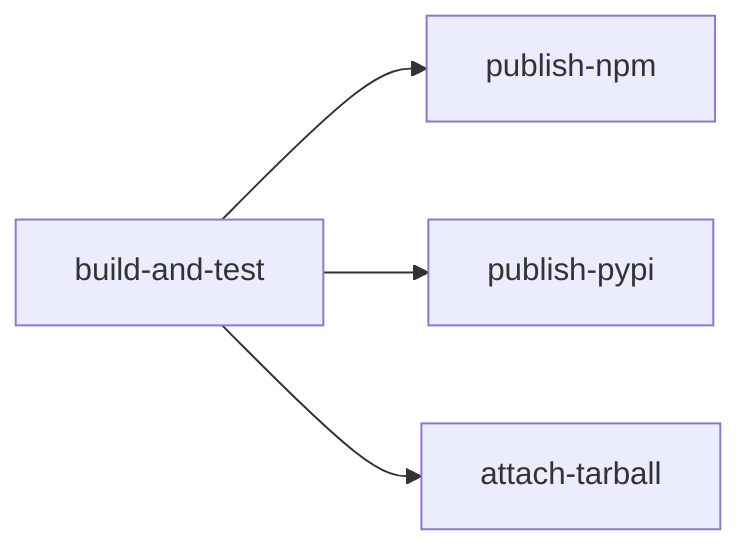

# 2026-02-16 Building and Publishing Packages Through GitHub Pipelines

This note describes how VecFS packages can be built, tested and published using GitHub Actions workflows and GitHub Packages, drawing on the official GitHub documentation and the conventions already established in the project.

# GitHub Actions Overview

GitHub Actions is the CI/CD platform built into GitHub. Workflows are defined as YAML files in `.github/workflows/` and are triggered by repository events such as pushes, pull requests, or releases. Each workflow contains one or more jobs that run on GitHub-hosted runners (Ubuntu, macOS, Windows) or self-hosted runners.

For VecFS, the pipeline must handle two language ecosystems (TypeScript and Python) and produce three distributable artefacts: an npm package, a PyPI wheel, and a bundled tarball.

# What VecFS Needs to Publish

## MCP Server (npm)

The primary deliverable. A single-file esbuild bundle published to the npm registry. Installed by users via `npm install -g vecfs` or run with `npx vecfs`.

## Embedding Script (PyPI)

A Python wheel published to PyPI. Installed by users via `uv tool install vecfs-embed` or `pip install vecfs-embed`.

## Distribution Tarball (GitHub Release)

The self-contained archive produced by `scripts/package.sh`, attached to a GitHub Release for offline installation.

# Workflow Design

The recommended approach uses a single workflow file triggered by a GitHub Release event. When a maintainer creates and publishes a release through the GitHub UI, the workflow runs all build and test steps, then publishes to npm, PyPI, and attaches the tarball to the release.

## Trigger

```yaml
on:
  release:
    types: [published]
```

The `release` event with `types: [published]` fires when a release is created through the GitHub UI or API. This gives the maintainer explicit control over when a publish happens: tagging alone does not trigger the pipeline; the release must be published.

## Job Structure

The workflow should be split into sequential jobs with dependencies so that a failure in testing prevents publication.



### Job 1: build-and-test

Checks out the code, builds both artefacts, runs all test suites, and uploads the built artefacts for downstream jobs.

### Job 2: publish-npm

Downloads the built artefact and publishes to npm.

### Job 3: publish-pypi

Downloads the built wheel and publishes to PyPI.

### Job 4: attach-tarball

Downloads the tarball and attaches it to the GitHub Release.

# Publishing to npm

## Registry Options

GitHub supports two npm registries.

### npmjs.org (Public npm Registry)

The standard public registry. Most MCP servers are published here because agent hosts like Cursor expect `npx` to resolve packages from npmjs.org. This is the recommended target for VecFS.

### GitHub Packages npm Registry

GitHub's own npm registry at `npm.pkg.github.com`. Packages must be scoped (e.g. `@WazzaMo/vecfs`). Useful for private or organisation-internal packages but adds friction for public consumers who must configure a `.npmrc` to point at the GitHub registry.

## Workflow Steps for npm

```yaml
publish-npm:
  runs-on: ubuntu-latest
  needs: build-and-test
  permissions:
    contents: read
    id-token: write
  steps:
    - uses: actions/checkout@v5
    - uses: actions/setup-node@v4
      with:
        node-version: "22.x"
        registry-url: "https://registry.npmjs.org"
    - run: npm ci
    - run: npm run build
    - run: npm publish --provenance --access public
      env:
        NODE_AUTH_TOKEN: ${{ secrets.NPM_TOKEN }}
```

### Key Details

#### NPM_TOKEN Secret

A repository secret containing an npm automation token. Created on npmjs.org under Access Tokens. The token must have publish permissions for the `vecfs` package.

#### setup-node with registry-url

The `actions/setup-node` action creates a local `.npmrc` that points at the specified registry and injects the `NODE_AUTH_TOKEN` for authentication.

#### Provenance

The `--provenance` flag generates a signed provenance statement linking the published package to this specific GitHub Actions run. This improves supply chain security and is recommended by npm for all public packages. It requires the `id-token: write` permission.

#### Access

The `--access public` flag is required if the package name could be interpreted as scoped. For the unscoped name `vecfs` it is optional but harmless.

# Publishing to PyPI

## Trusted Publishing (OIDC)

PyPI supports OpenID Connect (OIDC) trusted publishing, which eliminates the need for manually managed API tokens. The GitHub Actions runner requests a short-lived OIDC token, and PyPI verifies it against a pre-configured trust relationship.

### One-Time Setup on PyPI

1. Sign in to PyPI and navigate to the project's publishing settings.
2. Add a new trusted publisher with the GitHub repository owner, repository name, workflow filename, and optionally an environment name.
3. Once configured, the workflow can publish without any stored API token.

### Workflow Steps for PyPI

```yaml
publish-pypi:
  runs-on: ubuntu-latest
  needs: build-and-test
  permissions:
    id-token: write
  environment:
    name: pypi
  steps:
    - uses: actions/checkout@v5
    - uses: actions/setup-python@v5
      with:
        python-version: "3.x"
    - name: Build wheel
      working-directory: py-src
      run: |
        python -m pip install build
        python -m build
    - name: Publish to PyPI
      uses: pypa/gh-action-pypi-publish@release/v1
      with:
        packages-dir: py-src/dist/
```

### Key Details

#### id-token: write Permission

Mandatory for OIDC trusted publishing. The workflow requests a token from GitHub's OIDC provider, which PyPI verifies.

#### Environment Protection

The `environment: pypi` declaration ties the job to a GitHub environment. This enables required reviewer approval and branch restrictions as an additional gate before publishing.

#### No API Token Needed

With trusted publishing configured, the `pypa/gh-action-pypi-publish` action authenticates automatically. No `PYPI_TOKEN` secret is required.

## Alternative: API Token

If trusted publishing is not configured, a classic PyPI API token can be stored as a repository secret (`PYPI_TOKEN`) and passed to the publish action via the `password` input. Trusted publishing is preferred because it avoids long-lived secrets.

# Attaching the Tarball to a GitHub Release

The distribution tarball produced by `scripts/package.sh` can be attached to the release as a downloadable asset. This provides an installation path for users who cannot access npm or PyPI.

```yaml
attach-tarball:
  runs-on: ubuntu-latest
  needs: build-and-test
  permissions:
    contents: write
  steps:
    - uses: actions/checkout@v5
    - uses: actions/setup-node@v4
      with:
        node-version: "22.x"
    - uses: actions/setup-python@v5
      with:
        python-version: "3.x"
    - name: Install uv
      run: curl -LsSf https://astral.sh/uv/install.sh | sh
    - name: Build tarball
      run: ./scripts/package.sh
    - name: Upload to release
      env:
        GH_TOKEN: ${{ secrets.GITHUB_TOKEN }}
      run: |
        VERSION=$(node -e "process.stdout.write(require('./package.json').version)")
        gh release upload "${{ github.event.release.tag_name }}" \
          "vecfs-${VERSION}.tar.gz"
```

The `gh release upload` command uses the GitHub CLI (pre-installed on runners) to attach the file. The `contents: write` permission allows the workflow to modify the release.

# GitHub Packages as an Alternative Registry

GitHub Packages hosts npm packages at `npm.pkg.github.com`. For VecFS, using GitHub Packages instead of (or alongside) the public npm registry has trade-offs.

## Advantages

### Unified Permissions

Package visibility and access inherit from the repository by default. No separate npmjs.org account is needed.

### Free for Public Repos

Public packages on GitHub Packages are free with no storage or transfer limits.

### GITHUB_TOKEN Authentication

Within GitHub Actions, the `GITHUB_TOKEN` secret is automatically available and has `packages: write` permission when configured. No external secret is needed.

## Disadvantages

### Scoped Names Required

Packages must be scoped to the owner (e.g. `@WazzaMo/vecfs`). This changes the `npx` invocation to `npx @WazzaMo/vecfs` and requires consumers to configure a `.npmrc` to resolve the scope.

### Consumer Friction

Users must authenticate to `npm.pkg.github.com` even for public packages when installing via npm. This adds setup steps that do not exist with npmjs.org.

### Discovery

npmjs.org is the default registry for the entire Node.js ecosystem. Packages published only to GitHub Packages are less discoverable.

## Recommendation

Publish to npmjs.org as the primary channel. GitHub Packages can be used as a secondary mirror or for pre-release testing, but should not be the sole distribution point for a public package like VecFS.

# Approval and Protection Gates

GitHub provides several mechanisms to prevent accidental or unauthorised publishes.

## Environments with Required Reviewers

Create a GitHub environment (e.g. `npm-publish` or `pypi`) with required reviewers enabled. When the workflow reaches a job that references this environment, it pauses and waits for an approved reviewer to click "Approve" in the GitHub Actions UI. This is the strongest manual gate.

## Branch Protection Rules

Restrict which branches can trigger the release workflow. Since the trigger is `release: [published]`, the release itself is typically created from the default branch. Branch protection rules on `main` (require pull request reviews, require status checks) ensure that only reviewed and tested code reaches a publishable state.

## Environment Deployment Branch Restrictions

Within the environment settings, restrict deployments to only the `main` branch or specific tags. This prevents a workflow triggered from a feature branch from publishing.

## Secrets Scoped to Environments

Store the `NPM_TOKEN` in the `npm-publish` environment rather than as a repository-wide secret. This ensures only jobs running in that environment (and therefore subject to its protection rules) can access the token.

## Recommended Setup for VecFS

### Create Two Environments

Create `npm-publish` and `pypi`, each with at least one required reviewer.

### Store NPM_TOKEN in the npm-publish Environment

The token is only accessible to jobs running in that environment.

### Use Trusted Publishing for PyPI

No stored secret is needed; the OIDC trust relationship and environment protection provide the gate.

### Restrict Deployment Branches

Both environments should only allow deployments from the `main` branch.

# Complete Workflow Example

The following is a complete workflow file tailored to VecFS that combines all the pieces described above.

```yaml
name: Publish VecFS

on:
  release:
    types: [published]

jobs:
  build-and-test:
    runs-on: ubuntu-latest
    steps:
      - uses: actions/checkout@v5

      - uses: actions/setup-node@v4
        with:
          node-version: "22.x"

      - uses: actions/setup-python@v5
        with:
          python-version: "3.12"

      - name: Install uv
        run: curl -LsSf https://astral.sh/uv/install.sh | sh

      - name: Install Node dependencies
        run: npm ci

      - name: Build MCP server
        run: npm run build

      - name: Run TypeScript tests
        run: npm test

      - name: Install Python dependencies
        working-directory: py-src
        run: uv sync --extra dev

      - name: Run Python tests
        working-directory: py-src
        run: uv run pytest tests/test_sparsify.py -v

      - name: Build Python wheel
        working-directory: py-src
        run: uv build

      - name: Upload npm artefact
        uses: actions/upload-artifact@v4
        with:
          name: npm-package
          path: |
            dist/
            vecfs-memory/
            package.json
            README.md
            LICENSE

      - name: Upload PyPI artefact
        uses: actions/upload-artifact@v4
        with:
          name: pypi-package
          path: py-src/dist/

  publish-npm:
    runs-on: ubuntu-latest
    needs: build-and-test
    environment: npm-publish
    permissions:
      contents: read
      id-token: write
    steps:
      - uses: actions/checkout@v5
      - uses: actions/setup-node@v4
        with:
          node-version: "22.x"
          registry-url: "https://registry.npmjs.org"
      - run: npm ci
      - run: npm run build
      - run: npm publish --provenance --access public
        env:
          NODE_AUTH_TOKEN: ${{ secrets.NPM_TOKEN }}

  publish-pypi:
    runs-on: ubuntu-latest
    needs: build-and-test
    permissions:
      id-token: write
    environment:
      name: pypi
    steps:
      - uses: actions/checkout@v5
      - uses: actions/setup-python@v5
        with:
          python-version: "3.x"
      - name: Build wheel
        working-directory: py-src
        run: |
          python -m pip install build
          python -m build
      - name: Publish to PyPI
        uses: pypa/gh-action-pypi-publish@release/v1
        with:
          packages-dir: py-src/dist/

  attach-tarball:
    runs-on: ubuntu-latest
    needs: build-and-test
    permissions:
      contents: write
    steps:
      - uses: actions/checkout@v5
      - uses: actions/setup-node@v4
        with:
          node-version: "22.x"
      - uses: actions/setup-python@v5
        with:
          python-version: "3.12"
      - name: Install uv
        run: curl -LsSf https://astral.sh/uv/install.sh | sh
      - name: Install Node dependencies
        run: npm ci
      - name: Build tarball
        run: ./scripts/package.sh
      - name: Upload to release
        env:
          GH_TOKEN: ${{ secrets.GITHUB_TOKEN }}
        run: |
          VERSION=$(node -e "process.stdout.write(require('./package.json').version)")
          gh release upload "${{ github.event.release.tag_name }}" \
            "vecfs-${VERSION}.tar.gz"
```

# GitHub Packages Publishing Variant

If the project later decides to publish to GitHub Packages as well (for example, for pre-release versions), the npm publish job changes to target `npm.pkg.github.com` and uses `GITHUB_TOKEN` instead of an external secret.

```yaml
publish-github-packages:
  runs-on: ubuntu-latest
  needs: build-and-test
  permissions:
    contents: read
    packages: write
  steps:
    - uses: actions/checkout@v5
    - uses: actions/setup-node@v4
      with:
        node-version: "22.x"
        registry-url: "https://npm.pkg.github.com"
        scope: "@WazzaMo"
    - run: npm ci
    - run: npm run build
    - run: npm publish
      env:
        NODE_AUTH_TOKEN: ${{ secrets.GITHUB_TOKEN }}
```

This requires the package name in `package.json` to be scoped as `@WazzaMo/vecfs`. Since VecFS currently uses the unscoped name `vecfs` for public npm, this variant should only be used as a secondary channel.

# Setup Checklist

## One-Time Repository Configuration

### Create GitHub Environments

Create `npm-publish` and `pypi` environments in the repository settings. Add at least one required reviewer to each. Restrict deployment branches to `main`.

### Store NPM_TOKEN

Generate an automation token on npmjs.org and store it as a secret in the `npm-publish` environment.

### Configure PyPI Trusted Publisher

On PyPI, add a trusted publisher for the `vecfs-embed` project pointing to the repository, the workflow filename, and the `pypi` environment.

### Add the Workflow File

Commit the workflow YAML to `.github/workflows/publish.yml` on the `main` branch.

## Per-Release Process

### Update Versions

Bump the version in `package.json` and `py-src/pyproject.toml` as appropriate.

### Create a GitHub Release

Tag the commit (e.g. `v0.1.0`) and publish the release through the GitHub UI. This triggers the workflow.

### Review and Approve

When the workflow reaches the publish jobs, the required reviewers approve each environment. The packages are then published to npm, PyPI, and the tarball is attached to the release.

# Summary

GitHub Actions provides a complete pipeline from source to published package. For VecFS, the recommended approach is a single workflow triggered by a GitHub Release event, with three parallel publish jobs gated by environment protection rules. npm is the primary channel for the MCP server, PyPI (via OIDC trusted publishing) for the embedding script, and a GitHub Release asset for the self-contained tarball. GitHub Packages is available as an alternative npm registry but introduces consumer friction and should be reserved for secondary or pre-release use.
