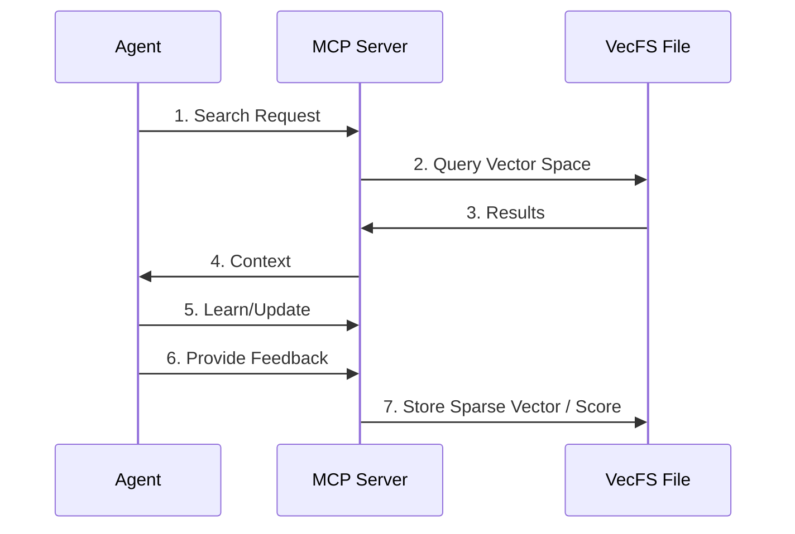

# Requirements for VecFS MCP Server

VecFS provides a lightweight, local vector storage mechanism designed for AI agent memory. The MCP (Model Context Protocol) server acts as the interface between the agent and the VecFS storage layer.

# Functional Requirements

The MCP server must implement the following core functionalities to enable a seamless context loop for agents.

## Providing Context to an Agent

The MCP server should expose VecFS data as resources or via tools that the agent can query.

### Search Tool

The server shall provide a `search` tool that allows an agent to query the vector space using natural language or existing vector embeddings.

### Context Injection

The server shall support "context injection" where relevant snippets from the vector store are automatically suggested or provided based on the current task.

### URI Addressing

Resources should be addressable via URIs that the agent can reference to retrieve specific learned items.

## Storing and Contributing Context

To allow an agent to "learn," it must be able to write back information to VecFS.

### Storage Tool

The server shall provide a `memorize` or `store` tool that accepts text content, generates an embedding (or accepts one), and stores it in the VecFS format.

### Sparse Storage

The storage process must adhere to the VecFS principle of "not storing zeros," ensuring that the local file remains compact.

### Memory Updates

The server shall allow updating existing memory entries if the agent learns new information that expands upon previous entries.

## Reinforcement and Feedback

Recording feedback allows the agent to improve its recall quality over time based on user or system validation.

### Feedback Tool

The server shall provide a `feedback` tool to record positive or negative reinforcement (e.g., a score or sentiment) for specific context or actions.

### Weighting

Feedback scores shall be used to influence the ranking of results in future searches, prioritizing positively reinforced context.

### Persistence

Reinforcement data must be stored alongside or associated with the relevant vector entries in the VecFS file.

## Search and Retrieval Mechanism

### Vector Transformation

The server must handle the transformation of agent queries into the vector space.

### Local Performance

Retrieval must be performant enough for real-time interaction on a local machine (e.g., WSL2/Linux/Mac).

### Metadata Filtering

The server should support filtering based on metadata (e.g., tags, timestamps, or project context).

# Integration Requirements

## Agent Interaction Flow

The success of the system depends on how the agent uses the MCP server.

## Interaction Steps

### Context Acquisition

When starting a task, the agent proactively searches the MCP server for relevant historical context.

### Context Contribution

After completing a task or learning a new fact, the agent uses the `store` tool to commit this knowledge to long-term memory.

### Feedback Loop

The agent or user provides reinforcement signals to the MCP server to refine future context retrieval.

# System Requirements

To be successful, the VecFS MCP implementation must meet these criteria:

## Local First

No dependency on external vector databases; all storage must be in local VecFS files.

## Efficiency

The system must implement the sparse vector storage model described in the goals, minimizing disk I/O and memory usage.

## Simplicity

The server should be easy to install and configure as a standard MCP server (e.g., via `npx` or `pip`).

## Reliability

Data must be stored in a way that is robust against corruption and easy to back up (simple file copy).

# Success Criteria

## Recall Accuracy

The agent can successfully retrieve relevant information from past sessions with high precision, improved by reinforcement.

## Storage Footprint

The VecFS file size should be significantly smaller than a dense vector representation of the same data.

## Low Latency

Context retrieval should add negligible overhead to the agent's response time.
