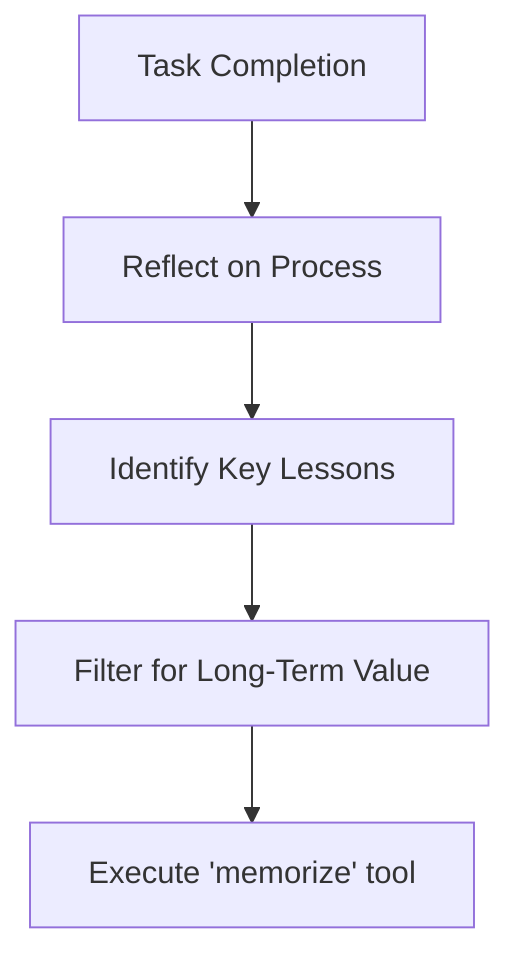

# Agent Skills for VecFS

A skill defines the behavioral logic and decision-making patterns an agent uses to interact with the VecFS MCP server. While the MCP server provides the tools, the skill ensures the agent uses them effectively to maintain long-term memory and improve performance.

# VecFS CLI Reference

The same behaviour is available from three language stacks. Use one of the following as the MCP server entry point.

## Main CLIs (MCP server)

| Program    | Description                          |
|------------|--------------------------------------|
| vecfs-go   | Go stack: build from go-src (see README) |
| vecfs-py   | Python: `pip install vecfs-embed` (provides vecfs-py) |
| vecfs-ts   | TypeScript: `npm install` then `npx vecfs-ts` or link global bin |

All three support the same configuration and environment variables so that skills and docs can refer to one behaviour.

## Common options

- **Config file**: `--config PATH` or env `VECFS_CONFIG`. Lookup order: env, then `./vecfs.yaml`, `./.vecfs.yaml`, `~/.config/vecfs/vecfs.yaml`.
- **Storage file**: config `storage.file` or env `VECFS_FILE` (overrides config).
- **MCP port** (HTTP mode): config `mcp.port` or env `PORT` (overrides config).

## Subcommands (by program)

- **vecfs-go**: `container start`, `container stop`, `version`. Container options use config `container.runtime` (docker|podman), `container.image`, `VECFS_EMBED_IMAGE`, etc.
- **vecfs-py**: `mcp` (stdio or `--http`), `version`.
- **vecfs-ts**: runs MCP server on stdio by default; pass `--config PATH` before other args if needed. HTTP mode and port come from config.

## Embed CLIs (text to vector)

For direct command-line embedding (e.g. to search memory or produce vectors outside MCP):

- **vecfs-embed-go**: `go build -o vecfs-embed-go ./cmd/vecfs-embed-go/`
- **vecfs-embed-py**: installed with Python package (also as `vecfs-embed` for backward compatibility).
- **vecfs-embed-ts**: `npm install` then `npx vecfs-embed-ts` (or link global bin); built with the same package as vecfs-ts.

Common parameters across embed CLIs: `--config`, `--model`, `--threshold`, `--batch` (stdin, one text per line), `--mode` (query|document). See each implementation’s help for full list.

# Skill Objectives

The primary goal of the VecFS skill is to transform a "stateless" agent into a "stateful" one that learns from every interaction.

## Context Awareness

Proactively retrieving relevant history before starting a task.

## Continuous Learning

Identifying and committing valuable new information to memory.

## Self-Correction

Using reinforcement signals to avoid repeating past mistakes.

# Core Behaviors

## Proactive Recall

At the beginning of any non-trivial task, the agent should perform a "Context Sweep."

### Intent Analysis

The agent identifies keywords or concepts in the user prompt.

### Search Execution

The agent calls the `search` tool to find relevant historical context.

### Context Integration

The agent incorporates the search results into its current reasoning path.

## Reflective Learning

After completing a task or achieving a milestone, the agent must reflect on the interaction.

## Feedback Integration

The agent should actively seek and process reinforcement signals.

### Positive Feedback

Record a high reinforcement score for the context used.

### Negative Feedback

Record a low/negative score and "learn" to avoid that path.

### Implicit Success

If the task succeeds without correction, record a baseline positive reinforcement.

# Implementation Guidelines

To implement these skills successfully, the agent's system prompt or specialized logic should follow these rules:

## Don't wait to be asked

Memory recall should be a default behavior for complex queries.

## Be selective

Do not memorize every line of conversation; only store facts, patterns, and corrections that have future utility.

## Audit the archive

Occasionally search for and reconcile conflicting information in the vector store.

# Success Criteria for Skills

## Habitual Recall

Percentage of tasks where the agent checked VecFS for context.

## Error Reduction

Decrease in repeated mistakes after negative reinforcement is recorded.

## Knowledge Density

Ratio of high-value "learned" entries versus "noise" in the storage.
