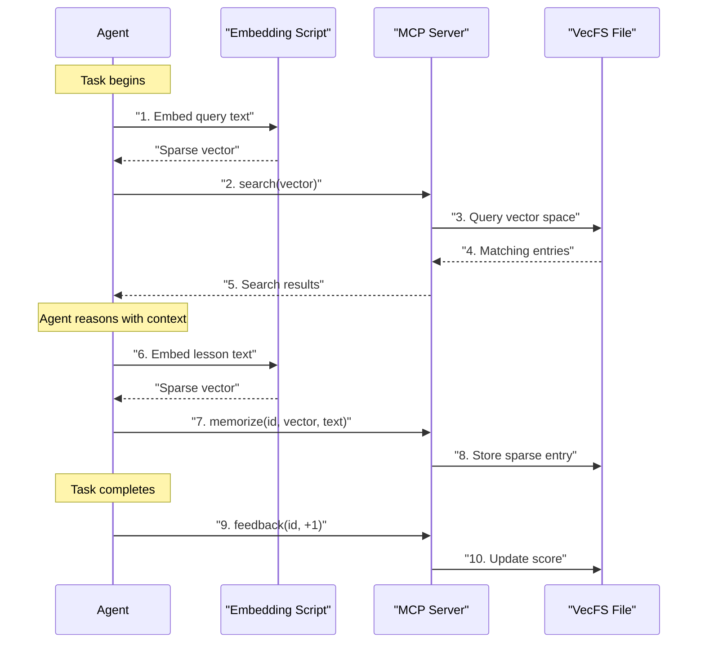
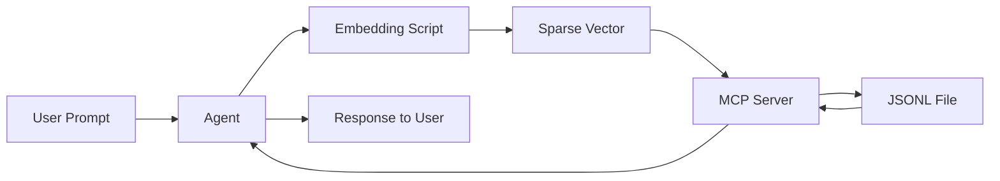

# Interaction Flow

The complete search-memorise-feedback loop between an agent, the MCP server, and VecFS storage.

# Sequence Diagram

```mermaid
sequenceDiagram
    participant Agent
    participant Embed as "Embedding Script"
    participant MCP as "MCP Server"
    participant VecFS as "VecFS File"

    Note over Agent: Task begins

    Agent->>Embed: "1. Embed query text"
    Embed-->>Agent: "Sparse vector"
    Agent->>MCP: "2. search(vector)"
    MCP->>VecFS: "3. Query vector space"
    VecFS-->>MCP: "4. Matching entries"
    MCP-->>Agent: "5. Search results"

    Note over Agent: Agent reasons with context

    Agent->>Embed: "6. Embed lesson text"
    Embed-->>Agent: "Sparse vector"
    Agent->>MCP: "7. memorize(id, vector, text)"
    MCP->>VecFS: "8. Store sparse entry"

    Note over Agent: Task completes

    Agent->>MCP: "9. feedback(id, +1)"
    MCP->>VecFS: "10. Update score"
```

# Data Flow

```mermaid
graph LR
    A["User Prompt"] --> B["Agent"]
    B --> C["Embedding Script"]
    C --> D["Sparse Vector"]
    D --> E["MCP Server"]
    E --> F["JSONL File"]
    F --> E
    E --> B
    B --> G["Response to User"]
```
